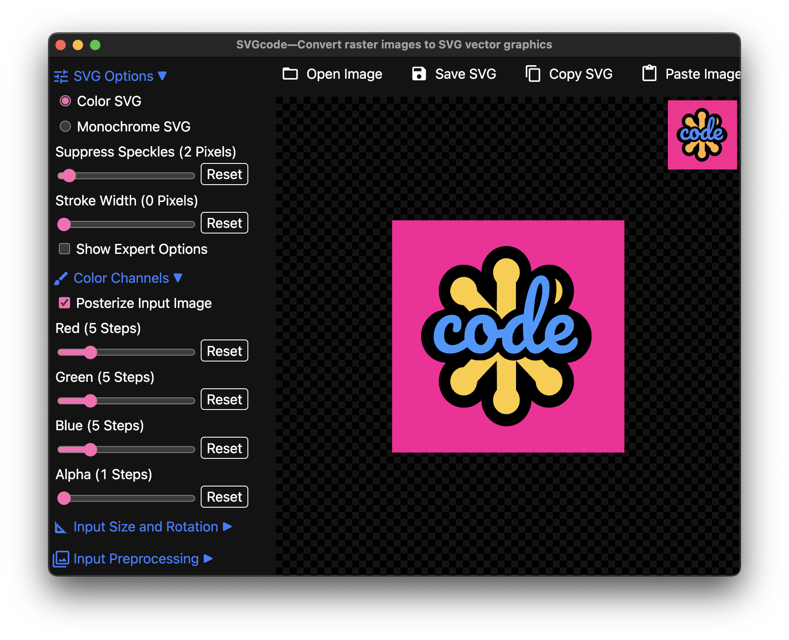

# Cross Platform Software Frameworks

This repository contains the same PWA, [SVGcode](https://svgco.de/), wrapped five times with different cross platform software frameworks.

## Getting started

SVGcode is included as a git submodule in each framework folder. To run the apps, you first need to build SVGcode, and then start the wrapper app.

```bash
npm run build-svgcode
npm start
```

## Included frameworks

- [Electron.js](https://electronjs.org/)
- [NW.js](https://nwjs.io/)
- [Tauri](https://tauri.app/)
- [Neutralinojs](https://neutralino.js.org/)
- [Gluon](https://gluonjs.org/)

## Screenshots

- Electron.js
  
- NW.js
  
- Tauri
  
- Neutralinojs
  
- Gluon
  

## Issues

```js
copy(JSON.stringify(await navigator.userAgentData.getHighEntropyValues([
  "architecture",
  "bitness",
  "model",
  "platformVersion",
  "uaFullVersion" ,
  "fullVersionList",
]), null, 2));
```

### Electron.js

Clicking the **Copy SVG** button causes an `Uncaught (in promise) ReferenceError: Cannot access 'P' before initialization.` error.

```json
{
  "architecture": "arm",
  "bitness": "64",
  "brands": [
    {
      "brand": "Not A(Brand",
      "version": "24"
    },
    {
      "brand": "Chromium",
      "version": "110"
    }
  ],
  "fullVersionList": [
    {
      "brand": "Not A(Brand",
      "version": "24.0.0.0"
    },
    {
      "brand": "Chromium",
      "version": "110.0.5481.100"
    }
  ],
  "mobile": false,
  "model": "",
  "platform": "macOS",
  "platformVersion": "13.3.0",
  "uaFullVersion": "110.0.5481.100"
}
```

### NW.js

Clicking the **Copy SVG** button causes an `Uncaught (in promise) ReferenceError: Cannot access 'P' before initialization.` error.

```json
{
  "architecture": "arm",
  "bitness": "64",
  "brands": [
    {
      "brand": "Not A(Brand",
      "version": "24"
    },
    {
      "brand": "Chromium",
      "version": "110"
    }
  ],
  "fullVersionList": [
    {
      "brand": "Not A(Brand",
      "version": "24.0.0.0"
    },
    {
      "brand": "Chromium",
      "version": "110.0.5481.97"
    }
  ],
  "mobile": false,
  "model": "",
  "platform": "macOS",
  "platformVersion": "13.3.0",
  "uaFullVersion": "110.0.5481.97"
}
```

### Tauri

Clicking the **Save SVG** button does nothing.

```bash
Mozilla/5.0 (Macintosh; Intel Mac OS X 10_15_7) AppleWebKit/605.1.15 (KHTML, like Gecko)
```

### Neutralinojs

Clicking the **Open Image** button does nothing. Clicking the **Save SVG** button does nothing.

```
Mozilla/5.0 (Macintosh; Intel Mac OS X 10_15_7) AppleWebKit/605.1.15 (KHTML, like Gecko)
```

### Gluon

Fails with a `RangeError Failed to execute 'createImageBitmap' on 'Window': The crop rect width is 0.`

```json
{
  "architecture": "arm",
  "bitness": "64",
  "brands": [
    {
      "brand": "Chromium",
      "version": "110"
    },
    {
      "brand": "Not A(Brand",
      "version": "24"
    },
    {
      "brand": "Google Chrome",
      "version": "110"
    }
  ],
  "fullVersionList": [
    {
      "brand": "Chromium",
      "version": "110.0.5481.177"
    },
    {
      "brand": "Not A(Brand",
      "version": "24.0.0.0"
    },
    {
      "brand": "Google Chrome",
      "version": "110.0.5481.177"
    }
  ],
  "mobile": false,
  "model": "",
  "platform": "macOS",
  "platformVersion": "13.3.0",
  "uaFullVersion": "110.0.5481.177"
}
```

## License

Apache 2.0
